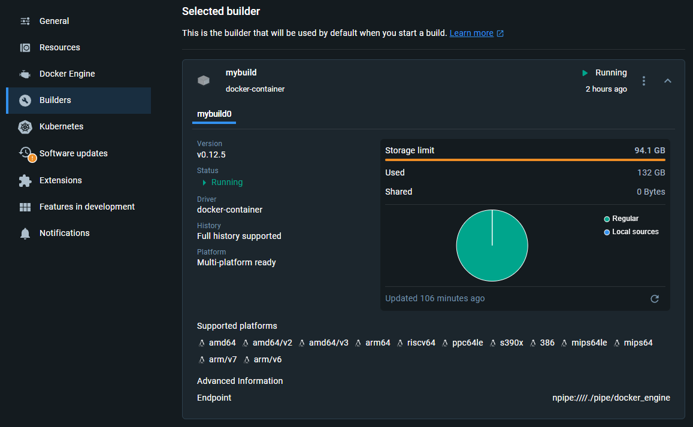

# Docker Container to Build Qt From Source

`build.sh` will invoke a docker container to build Qt from source. The output is compiled Qt library as tarball.

`dev.sh` will create a docker image containing Qt library that can be used to build Qt applications.

Both scripts will build for both linux amd64 and arm64 architecture.


## Requirement

It require docker buildx setup with using docker-container driver.

[Official Guide on Docker Buildx](https://docs.docker.com/reference/cli/docker/buildx/create/#driver)




## To Use `build.sh`

- Build Qt using `build.sh` script.
  
	It will produce an output to the `build-$version` folder.

	> Help Command
	```bash
	./build.sh --help
	```
	```bash
	Usage: build.sh [OPTIONS]
	Options:
        -h, --help                  Show this help message and exit

        -v, --version               List all available versions when no version specified

        -v, --version <VERSION>     Specify the version of Qt to build

        -r, --registry <REGISTRY>   Set the registry as prefix for image name

        -b, --build                 Build the Qt Builder image

        -p, --push                  Push the Qt Builder image to the registry
	```

	> Example of building Qt 6.6.3
	```bash
	./build.sh -v 6.6.3 -b
	```


## To Use `dev.sh`

- Build Qt development image using `dev.sh` script.

	> Help Command
	```bash
	./dev.sh --help
	```
	```bash
	Usage: dev.sh [OPTIONS]
	Options:
		-h, --help                  Show this help message and exit

		-v, --version <VERSION>     Specify the version of Qt to build

		-r, --registry <REGISTRY>   Set the registry as prefix for image name

		-b, --build                 Build the Qt Development image

		-p, --push                  Push the Qt Development image to the registry
	```

	> Example of making and pushing Qt 6.6.3 development image to the registry
	```bash
	./dev.sh -v 6.6.3 -b -r jasonyangee -p
	```


## Folders Created on the Build

| Folder | Description |
| ------ | ----------- |
| `build` | Contains compiled Qt library. |
| `src` | Contains downloaded Qt source code. |
| `cache` | Contains docker builderx cache. |


## Cautions

Building Qt is resource intensive. It is recommended to have at least **32GB of RAM** and **20 logical CPU cores**.


## Developer of GUI Application

The following example will focus on using RaspberryOS as the target device OS.

To start GUI application in docker container, you need to have the following setup:

1. Install `xhost` on the host machine.
	```bash
	sudo apt install x11-xserver-utils
	```

2. Allow the docker container to access the host X server.
	```bash
	xhost +local:
	```
	```bash
	# if running in ssh session
	export DISPLAY=:0
	```

3. Run the docker container with forwarding `DISPLAY env` and volume bind `x11 socket`.
	```bash
	docker run -it --rm -e DISPLAY=$DISPLAY -v /tmp/.X11-unix:/tmp/.X11-unix -v /app:/app <image_name>
	```


## ENV QT_QPA_PLATFORM=eglfs

`eglfs` is used as default. Change this in the `Dockerfile.dev` if you want to use another platform.